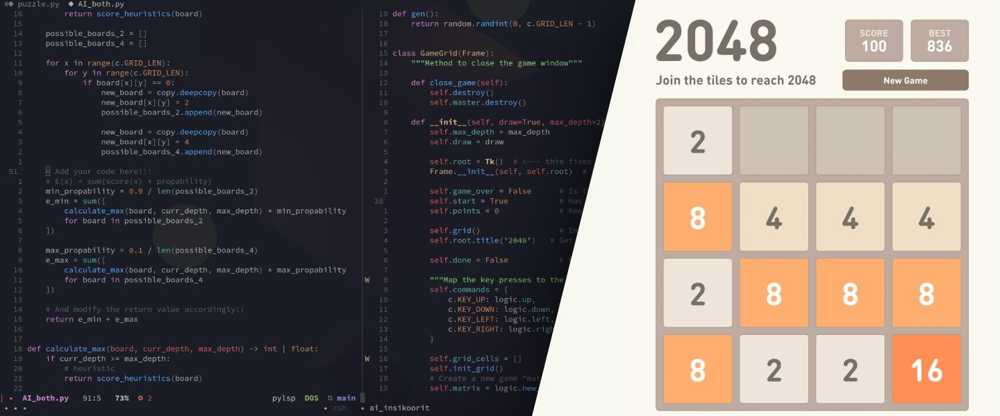

# 2048 - Heuristics and expectimax

## Assignment

#### Topic

The topic for the practice work is to develop AI code in Python that can play
so called 2048 game. This practice work has also been discussed much during
the lecture hours so some discussion on it can be found from videos also.

#### The practice work has two parts.

**First part: (1 points)**

In this part you need to add functionality to the Python code that is already
provided for you in this Topic such that you program the heuristic rules for
the program to play the game. The code template provided for you has one such
heuristic (empty_tile_heuristic) already implemented for you.

The evaluation of this part is based on the performance of this heuristic
algorithm of yours, how well you explain what your heuristics are and how well
you have tested the results for your algorithm. It is required that you run
simulation results over 100 runs for each of your heuristics/combination of
heuristics.

**Second part: (2 points)**

In this part you need to 1) implement so called expectimax algorithm to handle
chances included in the game. Also, 2) you would need to combine your heuristics
and the expectimax algorithms to work together. Again, run simulations over 100
runs to show how well your AI implementation works.

The evaluation of this part is based on how well you have implemented the
expectimax algorithm, how well you can explain how the algorithm works and how
well you have tested the results that you can obtain with your algorithm.
For example, again, it is good to report the results over 100 runs of your
algorithm for the game. Note! This Small Project is not evaluated much based
on the score you get with your AI for the game! Of course, however, good scores
in game usually go hand in hand with good implementation for AI. It is required
that each member in the team come up with at least two heuristics! So different
from the heuristics that other members in a team may have come up with.
The point is that you are able to explain what is the point of you heuristic
and that it is implemented in the code. However, what comes to the final AI,
that may not utilize all the heuristics from every member in your team.
It is your job to test what works the best and do the final selection of
heuristics for your AI based on that.

## Submission

1. The code in this directory

2. [Showcase Video](https://youtu.be/plBr7B_NQQA)
