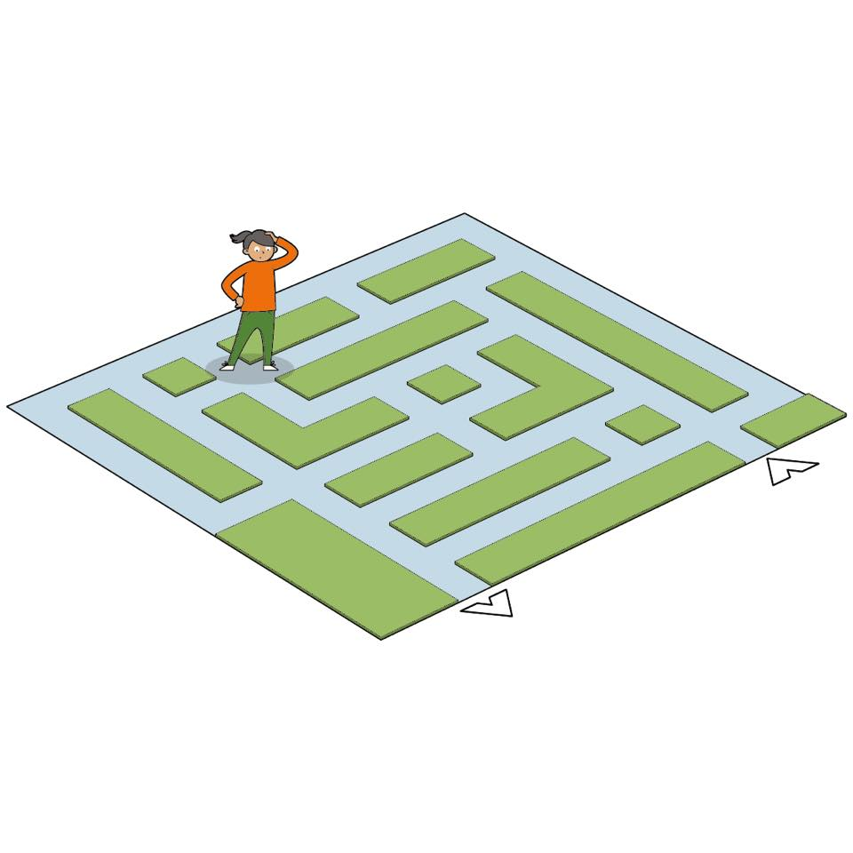
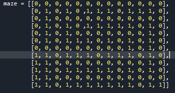

# A* Algorithm Assignment

## Assignment

In the course info we discussed that one part of the grading of the course is
based on the first small project, the project for modifying the existing code
for A* algorithm implementation. So this is the first small project. The code
is provided below. Remember that the teacher may give only fraction of the
points also if needed.

We discuss on this task during the lecture and there will be recording of that
also. But basically the attached algorithm below can solve various maze tasks
such that the maze is given in the grid form. Basically our task is to solve
the labyrinth below

 

This labyrinth/Maze can be coded in Python like this:

 

Here the allowed squares are marked with 0 and the wall with 1. 

The initial version of the algorithm is solving the maze with the rules that it
is possible always to move up, left, righ, down but also to up-left, up-right,
donw-left, down-right, hence diagonally. But your job is to modify the initial
version of the algorithm such that only moves straight forward and right are
allowed. The straight forward means to continue to the direction that we were
already just going and direction right is also interpreted based on the
direction that we were already just going.

You enter the maze in square (11,10) and you need to get to the square (11,2)
by applying allowed moves.

## Submission

1. This code directory

2. [Video showcase](https://youtu.be/k0cOSVaI8no)
