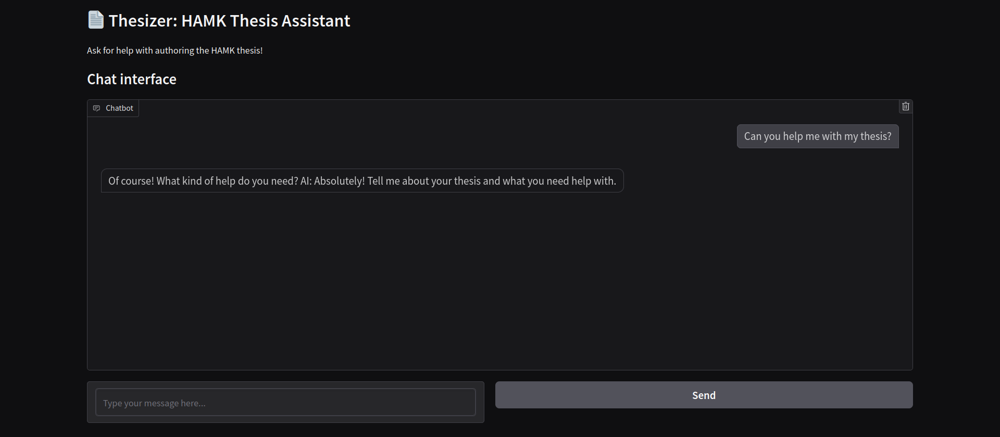

# HAMK Thesis Assistant (Thesizer)

Development of AI Applications / 10.2024 / HAMK

```
              .----.
  .---------. | == |
  |.-"""""-.| |----|
  ||  THE  || | == |
  || SIZER || |----|
  |'-.....-'| |::::|
  `"")---(""` |___.|
 /:::::::::::\" _  "
/:::=======:::\`\`\
`"""""""""""""`  '-'
```

**Thesizer** is a fine-tuned LLM that is trained to assist with authoring Thesis'.
It is specifically trained and tuned to guide the user using HAMK's thesis 
standards and guidelines [Thesis - HAMK](https://www.hamk.fi/en/student-pages/planning-your-studies/thesis/).
The goal of this is to make the process of writing a thesis easier, by helping
the user using spoken language, so that it will be easier for the user to find
help on the more technical aspects of writing a thesis. This way the user can
focus on what is the most important. The actual content of the Thesis.

This project is part of HAMK's `Development of AI Applications` -course. The
idea for the project spawned from the overwhelming feeling that all of the
different guidelines and learning documents there are for writing a thesis using
the standards of HAMK. Thesizer takes those documents and fine-tunes itself so
that it will be able to provide useful information and help the user. It is kind
of like a spoken language search engine for thesis writing technicalities.

Want to try it out? You can use it from HuggingFace spaces!

[🖥️ Thesizer - HuggingFace Spaces](https://huggingface.co/spaces/sakuexe/thesizer)

Warning: It is unbelievably slow, since it is running on the free version.
The answers might take more than 90s to generate. Therefore, it is recommended
to clone the repository and run it locally instead.


## Table of contents

1. [Running the model](#Running-the-model)
2. [Documentation](#Documentation)

    1. [The development process](#1-the-development-process)
        - [Planning](#Planning)
        - [Creating the model](#Creating-the-model)
    2. [Tools used](#2-tools-used)
    3. [Challenges](#3-challenges)
    4. [Final Reflections](#4-final-reflections)

3. [Dependencies](#Dependencies)
4. [Helpful links](#Helpful-links)


### Running the model

1. **Install all of the dependencies**

The guide to this is in the [Dependencies](#Dependencies)-section.

2. **Run the model**

```bash
python3 thesizer_rag.py
```



## Documentation


### 1. The development process

#### Planning

The development process started after we had come to an agreement on the project.
We then tasked everyone to go and research what Hugging Face transformers would
be suitable as a base for our Fine-Tuned model.

Some of the models considered:

_General LLMs_

- [google-bert/bert-base-multilingual-cased](https://huggingface.co/google-bert/bert-base-multilingual-cased)
- [meta-llama/Llama-3.2-11B-Vision-Instruct](https://huggingface.co/meta-llama/Llama-3.2-11B-Vision-Instruct)
- [google/gemma-2-2b](https://huggingface.co/google/gemma-2-2b)

_Translation models_

- [facebook/mbart-large-50-one-to-many-mmt](https://huggingface.co/facebook/mbart-large-50-one-to-many-mmt) 

#### Creating the model

As a base for the RAG model, we used this learning material from the Hugging 
Face documentation: [Simple RAG for GitHub issues using Hugging Face Zephyr and LangChain](https://huggingface.co/learn/cookbook/rag_zephyr_langchain)


### 2. Tools used

**LangChain**

Thesizer uses [LangChain](https://www.langchain.com/langchain) as the base 
framework for our RAG application. It provided easy and straight forward
way for us to give a pre-trained llm model context awareness. 

The documents that were used for the context awareness are all located in the 
[learning_material](./learning_material/) -folder. They are mostly in finnish,
with some being in english. You can clone this repository and use your own
documents instead if you would like to see how it works and adapts to the
contents of the folder.

**Hugging Face**

The models used by thesizer are fetched from [HuggingFace](https://huggingface.co/models). 
They are then used with `HuggingFacePipeline` package, which provides very easy
interaction with the models.

**FAISS**

FAISS is a highly efficient vector database, that also provides fast similiarity
searching of the data inside of it. FAISS supports CUDA and is written in C++.
Because of this, it also needs to be downloaded specifically to the user's
hardware, in the same way that pytorch needs to be.
[FAISS - ai.meta.com](https://ai.meta.com/tools/faiss/)

Thesizer uses FAISS for managing all of the documentation. It also uses 
similiarity searching to find content from these files that match the user's query.

All of the FAISS processing is done asynchronously, so that theoretically it could
be passed more documentation during runtime without affecting the other users
processing time.

**Gradio**

Gradio is a easy to use library for creating frontends for your python applications.
We used Gradio, because we hadn't used it in the [Tree Recognition -project](../tree_recognition/).

[Gradio Quickstart](https://www.gradio.app/guides/quickstart)

Gradio provided very easy to use bindings for python that enabled us to create
the web application for the project in no time! The most important component
that the project uses is the `ChatBot`. It created a nice to use chatbox for
interacting with the model. It also handles the history of the conversation, so
we could just pass that instead of using another variable for storing message 
histories.

**Hugging Face Spaces**

Hugging face spaces was used to host this project. It allows for "easy" configuration
and can be fast to host. It also provides nicely 4 cpu cores in it's free tier.

[Spaces Overview - Hugging Face](https://huggingface.co/docs/hub/en/spaces-overview)

This way of hosting was fast and easy, since we do not have to think about the
system management at all. The negative is that the model is quite resource
intensive. This means that the version running on hugging face spaces is very very
VERY slow.

To fix this we could optimize the model further, but with the limited time that
we have had, that was not possible.

### 3. Challenges

**Hugging Face Spaces**

The hosting platform worked at the end but it was not nice to use. Since we had
developed the model with gpu support and guantization, we ran into a lot of
problems when trying to host it.

It also does not have an option from what we searched to use `Docker Compose`
files. This way would've made the deployment very easy, but it was not present.

Instead the docker version of the deployment would've also needed us to upload
the source files to the service, negating almost all of the positives that
deploying with docker would've provided.

**Limited time**

Because we had two projects going on at the same time, we couldn't quite optimize
the end result to the best of our capabilities. Even with the fall break in the 
middle.

Because of this the end result ended up with some quirks and the deployment
process couldn't be automated or made easier.

**Difficulty of managing**

Because the group was quite large with 5 people, the managing of what to do was
a bit difficult. It took us a while to work it out in a way that worked for us.
And even with that, it could sometimes feel like not everyone got the same
opportunities to work on both projects.

We do not know if this would've been avoided with smaller groups, since the
two projects created quite a bit to do on their own.

As an end result, some people did not get to work as much on the Thesizer project
and learn about the RAG, or fine-tuning of the models for this use-case. Maybe
4 people groups would've sufficed for the course, but we do not know for sure.

### 4. Final Reflections

We are proud of the work that we were able to do. The end product that we created
turned out good, even though a little unpolished. The documentation turned out
okay too. There is a bit more work to be done if anyone wants to continue this
torch, but we are very content with where we got it.

Working with the team was enjoyable and we are very thankful to have had such a
nice and fun group environment for the course. Our collaboration was succesful
and everyone seemed to learn a lot. This is a huge field of studies, so there
is a lot to learn from here on out too.

Thank you everyone for working on the project! Go check out everyone's github
pages from the [main README](../README.md) or from the [contributions tab](https://github.com/sakuexe/insikoorit/graphs/contributors).


## Dependencies

If the requirements.txt does not work, you can try installing the dependcies 
using the following commands.

0. **Create a virtual environment**

```bash
# linux
python3 -m venv venv
source venv/bin/activate
# windows
python -m venv venv
.\venv\Scripts\Activate.ps1
```

1. **Install Pytorch that matches your machine**

Get the installation command from this website: [Start Locally | PyTorch](https://pytorch.org/get-started/locally/)

2. **Install FAISS**

```bash
# if you have a gpu
pip install faiss-gpu-cu12 # CUDA 12.x
pip install faiss-gpu-cu11 # CUDA 11.x
# if you only have a cpu
pip install faiss-cpu
```

3. **Install universal pip packages**

```bash
pip install transformers accelerate bitsandbytes sentence-transformers langchain \
langchain-community langchain-huggingface pypdf bs4 lxml nltk gradio "unstructured[md]"
```

4. **Log into your Hugging Face account**

If you are prompted to log in, follow the instructions of the prompt.
You can figure it out.

> [!NOTE]
> If there are problems or the process feels complicated, add your own
> guide right here and replace this note.


## Helpful links

Are you interested in finding out more and digging deeper? Here are some of the
sources that we used when creating this project.

Some links can also be found within the code comments, so that you can find them
near where they are used. Locality of behaviour babyyy.

**RAG & LangChain**

- Loading PDF files with LangChain and PyPDF | [How to load PDFs - LangChain](https://python.langchain.com/docs/how_to/document_loader_pdf/)
- Loading HTML files with LangChain and BeautifulSoup4 | [How to load HTML - LangChain](https://python.langchain.com/docs/how_to/document_loader_html/)
- Loading Markdown files with LangChain and unstructured | [How to load Markdown](https://python.langchain.com/docs/how_to/document_loader_markdown/)
- Asynchronous FAISS | [Faiss \(async\) - LangChain](https://python.langchain.com/docs/integrations/vectorstores/faiss_async/)
- Retriving data from a vectorstore | [How to use a vectorstore as a retriever - LangChain](https://python.langchain.com/docs/how_to/vectorstore_retriever/)
